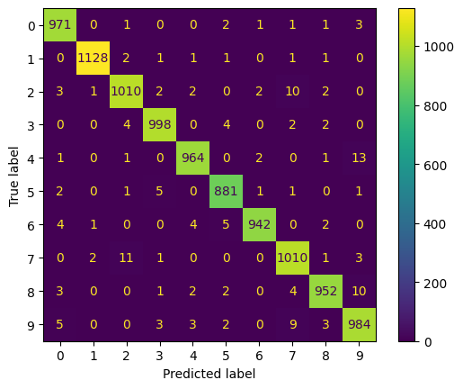

# MNIST Drawer 

An end-to-end implementation of MNIST digit recognition using CNN based classifier and Flask. 

## Getting Started

To start deploying in your local machine you can clone the repo and install all the required package 
```
pip install -r requirement.txt
```

### Dployment
To deploy first go into the deployment directory and run the command below after installing Flask using pip
```
python main.py 
```

## CNN Model 
The model used is a CNN based model with 2 convolutional stack and a classifier head. The model is trained on the MNIST dataset using the train set given by the MNIST dataset. The model gives really good performance illustrated by the confusion matrix below



The testing of the model also extend to the visualization of the model using GradCam implemented using hook on the model. Below is the GradCam result for every class 

